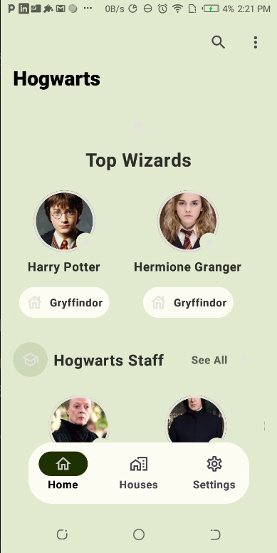
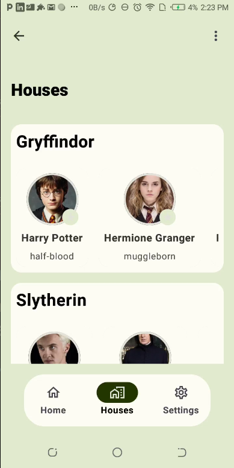
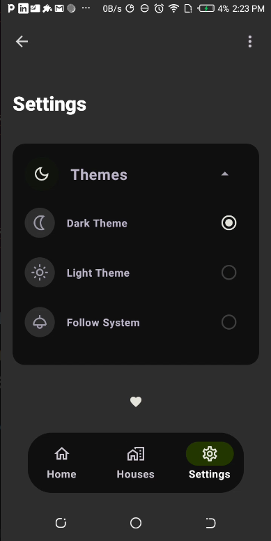

# HarryPoter

Android App that uses Retrofit and Jetpack Compose to easily consume a HarryPotter API and display information about characters. The app allows users to browse a list of characters and view detailed information about each one. The app has a clean, intuitive user interface built with Jetpack Compose, making it easy to use and navigate.

## Libraries

- Retrofit2
- Coil
- Compose Navigation
- Hilt Navigation
- LiveData
- ViewModel
- Dagger Hilt

## Features/Stories

- Show a list of characters
- See the details of character
- Search for a specific character by name or house 
- Unit Test that checks if API intergration is Working Properly


## API Reference

#### Live HarryPotter list

```http
  GET https://hp-api.onrender.com/api/characters/
```

| Base Url                           | Parameter    | Type     |
|:-----------------------------------|:-------------|:---------|
| `https://hp-api.onrender.com/api/` | `characters` | `string` |

#### Search for a specific character by name or house


```http
  GET https://hp-api.onrender.com/api/characters/house/gryffindor
```

| Base Url                           | Parameter      | Type     | Description          |
|:-----------------------------------|:---------------|:---------|:---------------------|
| `https://hp-api.onrender.com/api/` | `house/:house` | `string` | **Required**.  house |

<br>

## 🚀 Mad Scorecard

</img>

</img>

<br>

## 🍴 Stable Samples 

| Sample                                                       | Description                                 |
| ------------------------------------------------------------ | ------------------------------------------- |
| [master](https://github.com/hongbeomi/HarryPotter/tree/master) | Dependency injection with Koin              |
| [dagger-hilt](https://github.com/hongbeomi/HarryPotter/tree/dagger-hilt) | Dependency injection with Dagger-Hilt       |
| [app-startUp](https://github.com/hongbeomi/HarryPotter/tree/app-startup) | Initializing the app when it starts         |
| [compose](https://github.com/hongbeomi/HarryPotter/tree/compose) | Modern toolkit for building native UI       |


## 💎 Architecture

Harry Potter does not use a Local database.


## Documentation

[Documentation](https://hp-api.onrender.com/)

![App Screenshot]



## Get Your APK Here:
https://drive.google.com/file/d/1cVbot1fJ66oIiz6Sxap74zZaZS-0BfO5/view?usp=sharing

